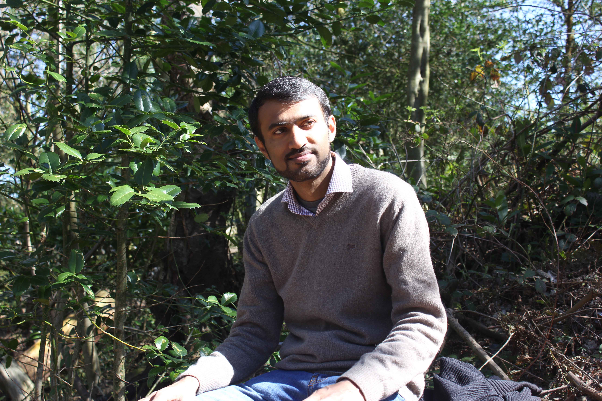
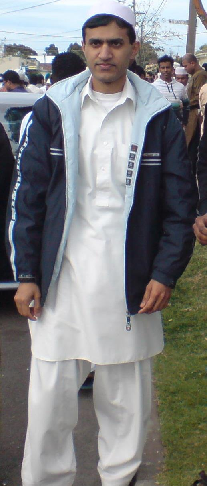
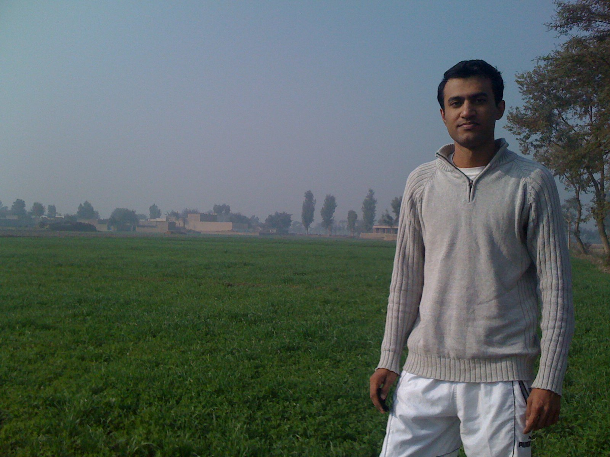
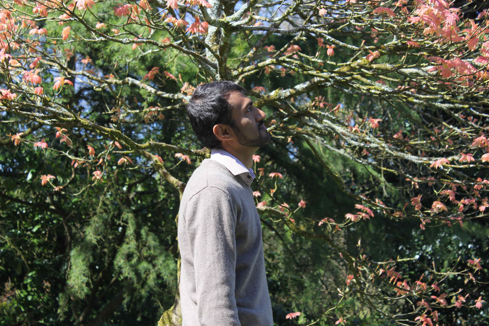
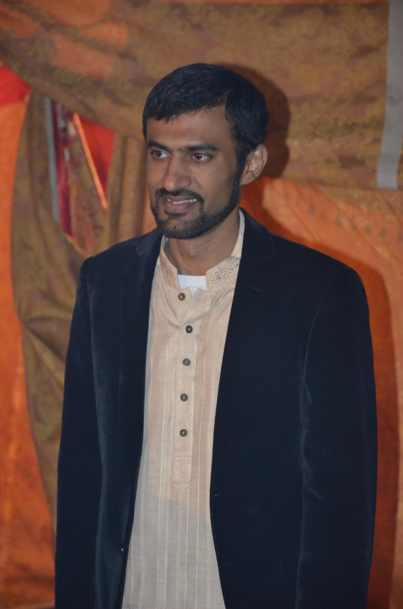
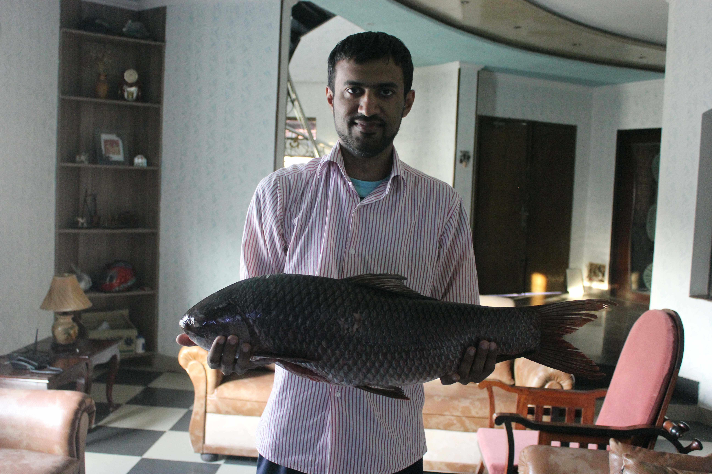
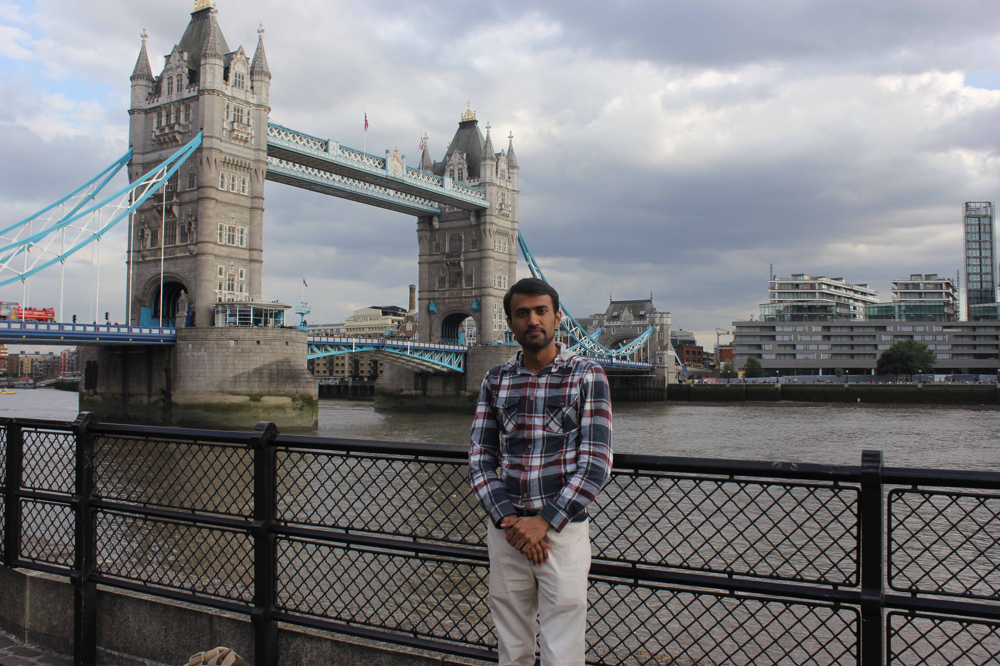

<!DOCTYPE html>
<html lang="en">
    <head>
        <title>Muhammad Sharjeel - Personal Webpage</title>
        <meta http-equiv="Content-Type" content="text/html; charset=UTF-8">
        <meta name="author" content="Muhammad Sharjeel">

        <meta name="viewport" content="width=device-width, initial-scale=1, maximum-scale=1">

        <meta name="description" content="Personal webpage of Muhammad Sharjeel" />
        <meta name="keywords" content="Muhammad Sharjeel, PhD Scholar, Faculty member, Assistant professor, Lancaster university, COMSATS Institute of Information Technology" />

        <!--<link rel="shortcut icon" href="http://owwwlab.com/favicon.ico">-->

        <!--CSS styles-->
        <link rel="stylesheet" href="css/bootstrap.css">
        <link rel="stylesheet" href="css/academicons.css">
        <link rel="stylesheet" href="css/font-awesome.min.css">  
        <link rel="stylesheet" href="css/perfect-scrollbar-0.4.5.min.css">
        <link rel="stylesheet" href="css/magnific-popup.css">
        <link rel="stylesheet" href="css/style.css">
        <link id="theme-style" rel="stylesheet" href="css/styles/default.css">
        

        
        <!--/CSS styles-->
        <!--Javascript files-->
        
        
        
        
        
        
        

        
        

        

        

        

        

        
        

        <!--/Javascript files-->

        <!--Custom Styles for demo only
        <link rel="stylesheet" href="custom-style.css">
        
        /Custom Styles-->

    </head>
    <body>

        

            <a href="#sidebar" class="mobilemenu"><i class="icon-reorder"></i></a>

            

                

                    

                        

                            <a href="index.html">

</a>
                            

                                <h2>Muhammad Sharjeel</h2>
                                <h3>Lancaster University</h3>
                            

                            
                        

                        <ul id="navigation">
                            <li>
                              <a href="#biography">
                                

                                
About Me

                              </a>
                            </li>  
                            
                            <li>
                              <a href="#research">
                                

                                
Research

                              </a>
                            </li> 
                            
                            <li>
                              <a href="#publications">
                                

                                
Publications

                              </a>
                            </li> 

                            <li>
                              <a href="#teaching">
                                

                                
Teaching

                              </a>
                            </li>

                            <li>
                              <a href="#gallery">
                                

                                
Gallery

                              </a>
                            </li>

                            <li>
                              <a href="#contact">
                                  

                                  
Contact Me

                              </a>
                            </li>

                            <li class="external">
                              <a href="#">
                                  

                                  
Download CV

                              </a>
                            </li>
                        </ul>
                    
        
                

                
                

                    <ul>
                        <li><a target="_blank" href="https://facebook.com/sharjeelmuhammad"><i class="icon-facebook"></i></a></li>
                        <li><a target="_blank" href="https://twitter.com/msharjeel"><i class="icon-twitter"></i></a></li>
                        <li><a target="_blank" href="https://linkedin.com/in/muhammad-sharjeel-8512796b"><i class="icon-linkedin"></i></a></li>
                        
                    </ul>
                
    
            

            

            
                

                    

                        

                            

                                
                                

                                    

                                    

                                        

                                            
                                            

                                                <h2 class=""><b>Muhammad Sharjeel</b></h2>
                                                <ul class="list-unstyled">
                                                    <li><h3>PhD Scholar</h3></li>
                                                    <li>School of Computing and Communications</li>
                                                    <li>InfoLab21</li>
                                                    <li>Lancaster University</li>
                                                    
                                                </ul>
                                            
 
                                            
                                               
                                        

                                        
                                    

                                    <!--

-->
                                    

                                        
                                        
I am Assistant Professor at <a target="_blank" href="http://lahore.comsats.edu.pk">COMSATS Institue of Information Technology, Lahore, Pakistan</a> and PhD scholar at <a target="_blank" href="http://lancaster.ac.uk">Lancaster University, Lancaster, United Kingdom</a>. I am a member and active participant at research groups, <a target="_blank" href="http://ucrel.lancs.ac.uk/">UCREL</a> at Lancaster University and <a target="_blank" href="https://sites.google.com/site/ciitlahorenlpt/">NLPT</a> at CIIT Lahore. I am currently working on "Cross-lingual Text Resue and Plagiarism Detection" with Dr. Paul Rayson and Dr. Rao Muhammad Adeel Nawab.

                                            
                                        
Teaching Interests: Natural Langauage Processing, Machine Learning, Network Security, Mobile Computing, Data Structures.

                                        
Research Interests: Urdu Natural Language Processing, Mono- and Cross-lingual Text Reuse and Plagiarism Detection.

                                        
                                    

                                    

                                        
&nbsp;

                                        
<h4 align="center"><i>In an open relationship with computers for 17 years and counting.</i></h4>

                                    <a href="#"><i class="fa fa-envelope-square fa-3x"></i></a>
                                    

                                    
                                

                            
        
                        

                    

                    

                    

                        

                            

                                

                                    

                                        

                                            <h3>Academic Positions</h3>
                                        

                                        <ul class="ul-dates">
                                            <li>
                                                

                                                    Present
                                                    2013
                                                

                                                

                                                    <h4>Assistant Professor</h4>
                                                    
<em>Computer Sciences Department</em>, COMSATS Institute of Information Technology, Lahore, Pakistan.

                                                

                                            </li>
                                            <li>
                                                

                                                    2013
                                                    2011
                                                

                                                

                                                    <h4>Lecturer</h4>
                                                    
<em>Computer Sciences Department</em>, COMSATS Institute of Information Technology, Lahore, Pakistan.

                                                

                                            </li>
                                            <li>
                                                

                                                    2011
                                                    2009
                                                

                                                

                                                    <h4>Lecturer</h4>
                                                    
<em>Computer Sciences Department</em>, Univerity of Lahore, Lahore, Pakistan.

                                                

                                            </li>
                                        </ul>
                                    

                                    

                                        

                                            <h3>Education</h3>
                                        

                                        <ul class="ul-card">
                                            <li>
                                                

                                                    Ph.D.
                                                    In Progress
                                                

                                                

                                                    
Doctor of Philosophy in Computer Science

                                                    
Lancaster University, Lancaster, UK.

                                                

                                            </li>
                                            <li>
                                                

                                                    M.Sc2009
                                                

                                                

                                                    
Master of Science in Computer Science

                                                    
Swinburne University of Technology, Melbourne, Australia.

                                                

                                            </li>
                                            <li>
                                                

                                                    B.C.S2006
                                                

                                                

                                                    
Bachelor of Science in Computer Science

                                                    
University of Peshawar, Pakistan.

                                                

                                            </li>
                                            <li>
                                                

                                                    H.S.S.C2001
                                                

                                                

                                                    
F.Sc (Pre-Engineering)

                                                    
P.E.F Model Degree College for Boys, Peshawar, Pakistan.

                                                

                                            </li>
                                            <li>
                                                

                                                    S.S.C1999
                                                

                                                

                                                    
Matric (Science)

                                                    
F.G. Boys High School for Boys, Peshawar, Pakistan.

                                                

                                            </li>
                                            
                                        </ul>

                                    
    
                                
    
                            

                                
                        

                        

                            

                                

                                    

                                        

                                            <h3>Honors, Awards and Grants</h3>
                                        

                                        <ul class="timeline">
                                                    
                                            <li class="open">
                                                
RPA 2013

                                                

                                                

                                                    
CIIT Research Productivity Award

                                                    

                                                        

                                                            
                                                        

                                                        

                                                            
Since its foundation, one of the chief aims of CIIT has been to promote quality research. This has been done by engaging its faculty, students and researchers to challenge existing ideas and by providing a research friendly environment. To encourage its faculty and promote quality research, CIIT-Research Productivity Awards are an annual feature. CIIT RPA for its Faculty, Staff and Students are for research papers published in a calendar year (in Impact factor and ISI indexed journals), the researchers will be awarded a certificate and cash prize.

                                                        

                                                    

                                                

                                            </li>
                                            <li>
                                                
ACS 2009

                                                

                                                

                                                    
Australian Computer Society Member

                                                    

                                                        

                                                            
                                                        

                                                        

                                                            
The Australian Computer Society is the professional association for Australia’s Information and Communication Technology (ICT) sector. ACS is about recognising professionalism, developing ICT skills and building a community with a true sense of belonging. It help members realise their professional ambitions in the global economy, making the most of an era of extraordinary possibility.

                                                        

                                                    

                                                

                                            </li>
                                        </ul>
                                    

                                

                            

                        
                            
                    

                

                

                    

                        

                            

                                <h2 class="title">Research Summary</h2>
                            
                                

                                    

                                        
In recent years, due to the easy access and vast amount of multi-lingual information readily available on the Web, cross language text reuse and plagiarism cases have increased considerably and became a matter of concern. To remedy this issue, its detection becomes equally important. However, research indicates that current systems fail to detect reuse when the source text has been obfuscated, i.e. paraphrased after translation from another language. Due to the implied complexity involved, research in this field is still in its infancy.

                                        
To develop and evaluate state-of-the-art methods for cross language text reuse and plagiarism detection, one obstacle is the shortage of benchmark corpora containing real or simulated examples. Majority of the corpora available are for English language (mono-lingual) or English-European languages (cross-lingual) and less focus has been devoted to developing resources for South Asian languages. The methods proposed in the literature for cross language text reuse and plagiarism detection task are based on the language syntax (CL-CNG), parallel (CL-ASA) or comparable corpora (CL-ESA), some require statistical dictionaries or knowledge bases (CL-CTS) and some others (T+MA) imply language normalisation at the preprocessing step. These methods have proven to produce fair results on syntactically similar languages and on verbatim cases of reuse. However, they have not been evaluated on cross-script cross language plagiarism detection, as most of them require supporting resources which are not ample for these under resourced languages (e.g. Urdu).

                                        
Therefore, the aim of my research is to develop large scale mono and cross language text reuse and plagiarism detection corpora (for English-Urdu language pair) and develop and evaluate automatic methods that can detect text reuse across languages by overcoming the limitations of existing methods.

                                        
                                    

                                    

                                        

                                            <h3>Interests</h3>
                                        

                                        <ul class="ul-boxed list-unstyled">
                                            <li>Natural Language Processing</li>
                                            <li>Cross Language Text Reuse Detection</li>
                                            <li>Cross Language Plagiarism Detection</li>
                                            <li>Urdu Natural Language Tooltik</li>
                                            <li>Urdu English Corpora Development</li>
                                            <li>Machine Learning</li>
                                        </ul>
                                    

                                

                            

                        

                    

                    

                        

                            

                                

                                    <h3>Great Personnel</h3>
                                

                                

                                    

                                        
                                        

                                            
                                            

                                                

                                                

                                                

                                                

                                                

                                                

                                                

                                            

                                            

                                                <a href="#" id="prev"><i class="icon-chevron-sign-left"></i></a>
                                                <a href="#" id="next"><i class="icon-chevron-sign-right"></i></a>
                                            

                                        

                                        

                                            

                                                <h3>Dr. Paul Clough</h3>
                                                <h4>Research Mentor</h4>
                                                <a href="#" class="btn btn-info">+ Follow</a>
                                            

                                            

                                                <h3>Dr. Mark Stevenson</h3>
                                                <h4>Research Mentor</h4>
                                                <a target="_blank" href="https://twitter.com/mstevenson_shef" class="btn btn-info">+ Follow</a>
                                            

                                            

                                                <h3>Dr. Rao Muhammad Adeel Nawab</h3>
                                                <h4>PhD Supervisor</h4>
                                                <a href="#" class="btn btn-info">+ Follow</a>
                                            

                                            

                                                <h3>Dr. Paul Rayson</h3>
                                                <h4>PhD Supervisor</h4>
                                                <a target="_blank" href="https://twitter.com/perayson" class="btn btn-info">+ Follow</a>
                                            

                                            

                                                <h3>Dr. Alberto Barr&oacute;n-Cede&ntilde;o</h3>
                                                <h4>Research Mentor</h4>
                                                <a target="_blank" href="https://twitter.com/_albarron_" class="btn btn-info">+ Follow</a>
                                            

                                            

                                                <h3>Jawad Shafi Mian</h3>
                                                <h4>Postdoctoral fellow</h4>
                                                <a href="#" class="btn btn-info">+ Follow</a>
                                            

                                            

                                                <h3>Touseef Tahir</h3>
                                                <h4>Postdoctoral fellow</h4>
                                                <a target="_blank" href="https://twitter.com/touseefroshan" class="btn btn-info">+ Follow</a>
                                            

                                        

                                    

                                    

                                        <h3></h3>
                                        
The list on the left displays my supervisors, research mentors in the field of NLP and few colleages that inspires and motivates me to work hard everyday.

                                    

                                

                            

                        

                        
                        

                            

                                

                                    <h3>Research Projects</h3>
                                

                                

                                    

                                        <ul class="ul-withdetails">
                                            <li>
                                                

                                                    

                                                        

                                                            
                                                            

                                                                <i class="icon icon-search"></i>
                                                            

                                                        

                                                    

                                                    

                                                        

                                                            <h3>COUNTER</h3>
                                                            
Corpus Of Urdu News TExt Reuse

                                                        

                                                    

                                                

                                                

                                                    
COUNTER - Corpus Of Urdu News TExt Reuse is a Urdu text reuse corpus developed at CIIT Lahore in partnership with Lancaster University. The corpus is released with an intention that it will foster the research in mono-lingual text reuse detection systems specifically for Urdu language. The corpus has 600 source and 600 derived (suspicious) documents. It contains in total 275,387 words (tokens), 21,426 unique words and 10,841 sentences. It has been manually annotated at document level with three levels of reuse: wholly derived (135), partially derived (288) and non derived (177).

                                                    
<a target="_blank" href="http://ucrel.lancs.ac.uk/textreuse/index.php">Click here for details</a>

                                                

                                            </li>
                                            <li>
                                                

                                                    

                                                        

                                                            
                                                            

                                                                <i class="icon icon-search"></i>
                                                            

                                                        

                                                    

                                                    

                                                        

                                                            <h3>TRUE</h3>
                                                            
Text Reuse Urdu English

                                                        

                                                    

                                                

                                                

                                                    
TRUE - Text Reuse English Urdu is a research project between NLPT at CIIT Lahore, Pakistan and UCREL at Lancaster University, Lancaster, UK. It aims to develop cross script cross language corpora and methods to detect text reuse at both document and sentence level. An initial corpus is under development that contains 2,500 source derived document pairs. The source and derived documents are from the field of journalism and contain real example of text reuse.

                                                    
<a target="_blank" href="http://ucrel.lancs.ac.uk/textreuse/index.php">Click here for details</a>

                                                

                                            </li>
                                            <li>
                                                

                                                    

                                                        

                                                            
                                                            

                                                                <i class="icon icon-search"></i>
                                                            

                                                        

                                                    

                                                    

                                                        

                                                            <h3>UPlag</h3>
                                                            
Urdu Plagiarism

                                                        

                                                    

                                                

                                                

                                                    
UPlag is a project that aims to contribute benchmark Urdu Plagiarism corpus with simulated as well as artificial examples of plagiarism. Moreover, the project has a secondary focus on developing (or modifying) state-of-the-art techniques for Urdu plagiarism detection system.

                                                

                                            </li>
                                            <li>
                                                

                                                    

                                                        

                                                            
                                                            

                                                                <i class="icon icon-search"></i>
                                                            

                                                        

                                                    

                                                    

                                                        

                                                            <h3>UPPC</h3>
                                                            
Urdu Paraphrase Plagiarism Corpus

                                                        

                                                    

                                                

                                                

                                                    
UPPC is a corpus that contains 160 documents (20 source documents and 140 suspicious ones). The source documents are original Wikipedia articles on 20 personalities while the set of suspicious documents are either manually paraphrased versions produced by applying different rewriting techniques or set of independently written (non-plagiarised) documents. The resource is the first of its kind developed for the Urdu language and we believe that it will be a valuable contribution to the evaluation of paraphrase plagiarism detection systems. The corpus can be used for: (1) the development, analysis and evaluation of automated paraphrase plagiarism detection systems for Urdu language, (2) identifying which types of obfuscations (paraphrase strategies) are easy or difficult to detect and (3) would be a valuable resource for Urdu paraphrase identification task.

                                                

                                            </li>
                                        </ul>
                                    

                                

                            

                        
    
                    

                

                

                    

                        

                            

                                

                                    
                                    <h2 class="title">Selected Publications</h2>
                                    
                                

                            

                        

                        

                            
                            

                                

                                    

                                        
                                        

                                            <h3>Filter by type:</h3>
                                        

                                        

                                            <select id="cd-dropdown" name="cd-dropdown" class="cd-select">
                                                <option class="filter" value="all" selected>All types</option>
                                                <option class="filter" value="jpaper">Jounal Papers</option>
                                                <option class="filter" value="cpaper">Conference Papers</option>
                                                <option class="filter" value="bookchapter">Book Chapters</option>
                                                <option class="filter" value="book">Books</option>
                                            </select>
                                        

                                        
                                        

                                            Sort by year:
                                            
 

                                                <button type="button" data-sort="data-year" data-order="desc" class="sort btn btn-default"><i class="icon-sort-by-order"></i></button>
                                                <button type="button" data-sort="data-year" data-order="asc" class="sort btn btn-default"><i class="icon-sort-by-order-alt"></i></button>
                                            

                                        
    
                                    

                                

                            

                            

                                

                                    
                                    

                                        

                                            

                                                
                                         
                                                
                                                
                                                

                                                    

                                                        

                                                            
                                                            <a href="#" class="pubcollapse">
                                                                <i class="icon-expand-alt"></i>
                                                            </a>
                                                            <a href="https://doi.org/10.1002/asi.24074" class="tooltips" title="External link" target="_blank">
                                                                <i class="icon-external-link"></i>
                                                            </a>
                                                            <a href="https://doi.org/10.1002/asi.24074" class="tooltips" title="Download" target="_blank">
                                                                <i class="icon-cloud-download"></i>
                                                            </a>
                                                            
                                                        

                                                        <h4 class="pubtitle">CLEU - A Cross-Language English-Urdu Corpus and Benchmark for Text Reuse Experiments</h4>
                                                        
Iqra Muneer, <strong>Muhammad Sharjeel</strong>, Muntaha Iqbal, Rao Muhammad Adeel Nawab, Paul Rayson

                                                        
Journal PaperJournal of the Association for Information Science and Technology, IF: 3.244

                                                        
                                                    

                                                    

                                                        <h4>Abstract</h4>
                                                        
Text reuse is becoming a serious issue in many fields and research shows that it is much harder to detect when it occurs across languages. The recent rise in multi-lingual content on the Web has increased cross-language text reuse to an unprecedented scale. Although researchers have proposed methods to detect it, one major drawback is the unavailability of large-scale gold standard evaluation resources built on real cases. To overcome this problem, we propose a cross-language sentence/passage level text reuse corpus for the English-Urdu language pair. The Cross-Language English-Urdu Corpus (CLEU) has source text in English whereas the derived text is in Urdu. It contains in total 3,235 sentence/passage pairsmanually tagged into three categories that is near copy, paraphrased copy, and independently written. Further, as a second contribution, we evaluate the Translation plus Mono-lingual Analysis method using three sets of experiments on the proposed dataset to highlight its usefulness. Evaluation results (f1=0.732 binary, f1=0.552 ternary classification) indicate that it is harder to detect cross-language real cases of text reuse, especially when the language pairs have unrelated scripts. The corpus is a useful benchmark resource for the future development and assessment of cross-language text reuse detection systems for the English-Urdu language pair.

                                                    

                                                

                                                

                                                

                                                    

                                                        

                                                            
                                                            <a href="#" class="pubcollapse">
                                                                <i class="icon-expand-alt"></i>
                                                            </a>
                                                            <a href="https://doi.org/10.1109/ACCESS.2017.2776842" class="tooltips" title="External link" target="_blank">
                                                                <i class="icon-external-link"></i>
                                                            </a>
                                                            <a href="https://doi.org/10.1109/ACCESS.2017.2776842" class="tooltips" title="Download" target="_blank">
                                                                <i class="icon-cloud-download"></i>
                                                            </a>
                                                            
                                                        

                                                        <h4 class="pubtitle">Measuring Short Text Reuse For The Urdu Language</h4>
                                                        
Sara Sameen, <strong>Muhammad Sharjeel</strong>, Rao Muhammad Adeel Nawab, Paul Rayson, Iqra Muneer

                                                        
Journal PaperIEEE Access IF: 3.244

                                                        
                                                    

                                                    

                                                        <h4>Abstract</h4>
                                                        
Text reuse occurs when one borrows the text (either verbatim or paraphrased) from an earlier written text. A large and increasing amount of digital text is easily and readily available, making it simpler to reuse but difficult to detect. As a result, automatic detection of text reuse has attracted the attention of the research community due to the wide variety of applications associated with it. To develop and evaluate automatic methods for text reuse detection, standard evaluation resources are required. In this work, we propose one such resource for a significantly under-resourced language - Urdu, which is widely used in day to day communication and has a large digital footprint particularly in the Indian subcontinent. Our proposed Urdu Short Text Reuse Corpus contains 2,684 short Urdu text pairs, manually labelled as verbatim (496), paraphrased (1,329), and independently written (859). In addition, we describe an evaluation of the corpus using various state-of-the-art text reuse detection methods with binary and multi-classification settings and a set of four classifiers. Output results show that Character n-gram Overlap using J48 classifier outperform other methods for the Urdu short text reuse detection task.

                                                    

                                                

                                                

                                                

                                                    

                                                        

                                                            
                                                            <a href="#" class="pubcollapse">
                                                                <i class="icon-expand-alt"></i>
                                                            </a>
                                                            <a href="https://link.springer.com/article/10.1007/s10579-016-9367-2" class="tooltips" title="External link" target="_blank">
                                                                <i class="icon-external-link"></i>
                                                            </a>
                                                            <a href="https://link.springer.com/article/10.1007/s10579-016-9367-2" class="tooltips" title="Download" target="_blank">
                                                                <i class="icon-cloud-download"></i>
                                                            </a>
                                                            
                                                        

                                                        <h4 class="pubtitle">COUNTER - COrpus of Urdu News TExt Reuse</h4>
                                                        
<strong>Muhammad Sharjeel</strong>, Rao Muhammad Adeel Nawab, Paul Rayson

                                                        
Journal PaperLanguage Resources and Evaluation (LREV) IF: 0.738

                                                        
                                                    

                                                    

                                                        <h4>Abstract</h4>
                                                        
Text reuse is the process of creating new texts using existing ones. Freely available and easily accessible large on-line repositories are not only making reuse of text more common in society but also harder to detect programmatically. A major hindrance in the development and evaluation of existing mono-lingual text reuse detection methods, especially for South Asian languages, is the unavailability of standardized benchmark corpora. Amongst other things, a gold standard corpus enables researchers to directly compare with existing state-of-the-art methods. In our study, we address this gap by developing a benchmark corpus for one of the widely spoken but under resourced languages i.e. Urdu. The COUNTER corpus contains 1,200 documents with real examples of text reuse from the field of journalism. It has been manually annotated at document level with three levels of reuse: wholly derived, partially derived and non derived. In this paper, we also apply two simple similarity estimation methods (n-gram overlap and longest common subsequence) on our corpus to show how it can be used in the evaluation of text reuse detection systems. The corpus is a vital resource for the development and evaluation of text reuse detection systems in general and specifically for Urdu language.

                                                    

                                                

                                                
                                                
                                                
                                                

                                                    

                                                        

                                                            
                                                            <a href="#" class="pubcollapse">
                                                                <i class="icon-expand-alt"></i>
                                                            </a>
                                                            <a href="http://www.lrec-conf.org/proceedings/lrec2016/pdf/364_Paper.pdf" class="tooltips" title="External link" target="_blank">
                                                                <i class="icon-external-link"></i>
                                                            </a>
                                                            <a href="http://www.lrec-conf.org/proceedings/lrec2016/pdf/364_Paper.pdf" class="tooltips" title="Download" target="_blank">
                                                                <i class="icon-cloud-download"></i>
                                                            </a>
                                                            
                                                        

                                                        <h4 class="pubtitle">UPPC - Urdu Paraphrase Plagiarism Corpus</h4>
                                                        
<strong>Muhammad Sharjeel</strong>,  Paul Rayson, Rao Muhammad Adeel Nawab

                                                        
Conference PapersLanguage Resource and Evaluation Conference (LREC) 2016

                                                        
                                                    

                                                    

                                                        <h4>Abstract</h4>
                                                        
Paraphrase plagiarism is a significant and widespread problem and research shows that it is hard to detect. Several methods and automatic systems have been proposed to deal with it. However, evaluation and comparison of such solutions is not possible because of the unavailability of benchmark corpora with manual examples of paraphrase plagiarism. To deal with this issue, we present the novel development of a paraphrase plagiarism corpus containing simulated (manually created) examples in the Urdu language - a language widely spoken around the world. This resource is the first of its kind developed for the Urdu language and we believe that it will be a valuable contribution to the evaluation of paraphrase plagiarism detection systems.

                                                    

                                                

                                            

                                        

                                    

                                

                            

                        

                    

                

                

                    

                        

                            

                                
                                <h2 class="title">Teaching</h2>
                                
                                

                                    

                                        
I am in the 9th year of my teaching career and have taught diverse (from basic to advanced) subjects. Currently I am involved in part time teaching along side my PhD research work.

                                    

                                

                            

                        

                    

                    

                        

                            

                                

                                    

                                        <h3>Currrent Teaching</h3>
                                    

                                    <ul class="ul-dates">
                                        <li>
                                            

                                                Spring
                                                2019
                                            

                                            

                                                <h4>CSC101 - Introduction to ICT</h4>
                                                

                                            

                                        </li>
                                    </ul>
                                

                            

                        

                        

                            

                                

                                    

                                        <h3>Teaching History</h3>
                                    

                                    <h4 align="center">COMSATS Institute of Information Technology, Lahore</h4>
                                    <ul class="ul-dates-gray">
                                        <li>
                                            

                                                Fall
                                                2018
                                            

                                            

                                                <h4>CSC101 - Introduction to Computing</h4>
                                                

                                            

                                        </li>
                                        <li>
                                            

                                                Spring
                                                2018
                                            

                                            

                                                <h4>CSC101 - Introduction to ICT</h4>
                                                

                                            

                                        </li>
                                        <li>
                                            

                                                Fall
                                                2017
                                            

                                            

                                                <h4>CSC101 - Introduction to Computing</h4>
                                                

                                            

                                        </li>
                                        <li>
                                            

                                                Spring
                                                2017
                                            

                                            

                                                <h4>CSC111 - Algorithms</h4>
                                                

                                            

                                        </li>
                                        <li>
                                            

                                                Fall
                                                2015
                                            

                                            

                                                <h4>CSC101 - Introduction to Computing</h4>
                                                

                                            

                                        </li>
                                        <li>
                                            

                                                Fall
                                                2014
                                            

                                            

                                                <h4>CSC101 - Introduction to Computing</h4>
                                                

                                                <h4>CSC332 - Network Security</h4>
                                                

                                            

                                        </li>
                                        <li>
                                            

                                                Spring
                                                2014
                                            

                                            

                                                <h4>CSC101 - Introduction to Computing</h4>
                                                

                                                <h4>CSC332 - Network Security</h4>
                                                

                                            

                                        </li>
                                        <li>
                                            

                                                Fall
                                                2013
                                            

                                            

                                                <h4>CSC101 - Introduction to Computing</h4>
                                                

                                                <h4>CSC344 - Wireless and Mobile Computing</h4>
                                                

                                            

                                        </li>
                                        <li>
                                            

                                                Spring
                                                2013
                                            

                                            

                                                <h4>CSC101 - Introduction to Computing</h4>
                                                

                                                <h4>CSC344 - Wireless and Mobile Computing</h4>
                                                

                                            

                                        </li>
                                        <li>
                                            

                                                Fall
                                                2012
                                            

                                            

                                                <h4>CSC401 - Computing for Management</h4>
                                                

                                                <h4>CSC344 - Wireless and Mobile Computing</h4>
                                                

                                            

                                        </li>
                                        <li>
                                            

                                                Spring
                                                2012
                                            

                                            

                                                <h4>CSC401 - Computing for Management</h4>
                                                

                                                <h4>CSC141 - Introduction to Computer Programming</h4>
                                                

                                            

                                        </li>
                                        <li>
                                            

                                                Fall
                                                2011
                                            

                                            

                                                <h4>CSC401 - Computing for Management</h4>
                                                

                                                <h4>CSC101 - Introduction to Computing</h4>
                                                

                                            

                                        </li>
                                        <li>
                                            

                                                Spring
                                                2011
                                            

                                            

                                                <h4>CSC101 - Introduction to Computing</h4>
                                                

                                                <h4>CSC112 - Algorithms and Data Structures</h4>
                                                

                                            

                                        </li>
                                        

                                        <h4 align="center">University of Lahore</h4>
                                        <li>
                                            

                                                Fall
                                                2010
                                            

                                            

                                                <h4>CSC1012 - Programming Fundamentals</h4>
                                                

                                                <h4>CSC3535 - Computer Networks</h4>
                                                

                                                <h4>ECE3323 - Data Communications</h4>
                                                

                                                <h4>CS522 - Network Security and Cryptography</h4>
                                                

                                            

                                        </li>
                                        <li>
                                            

                                                Winter
                                                2010
                                            

                                            

                                                <h4>CSC1011 - Introduction to Computing</h4>
                                                

                                                <h4>CSC3535 - Computer Networks</h4>
                                                

                                                <h4>ECE3323 - Data Communications</h4>
                                                

                                                <h4>CS521 - Advanced Computer Networks</h4>
                                                

                                            

                                        </li>
                                    </ul>
                                

                            

                        

                    

                

                
                

                    

                        
                        

                            

                                

                                    

                                        <h2>Gallery</h2>
                                    

                                    

                                        <h3> <i>Through the Lens of my Life.</i></h3>
                                    

                                

                            

                        

                        

                            

                                
                                <ul id="grid" class="grid">
                                    <li>
                                        

                                            
                                            <a href="img/gallery/06.jpg" class="popup-with-move-anim">
                                                

                                                    

                                                        <i class="icon-search"></i>
                                                        

                                                    

                                                

                                            </a>
                                        

                                    </li>
                                    <li>
                                        

                                            
                                            <a href="img/gallery/09.jpg" class="popup-with-move-anim">
                                                

                                                    

                                                        <i class="icon-search"></i>
                                                        

                                                    

                                                

                                            </a>
                                        

                                    </li>
                                    <li>
                                        

                                            
                                            <a href="img/gallery/04.jpg" class="popup-with-move-anim"> 
                                                

                                                    

                                                        <i class="icon-search"></i>
                                                        

                                                    

                                                

                                            </a>
                                        

                                    </li>
                                    <li>
                                        

                                            
                                            <a href="img/gallery/07.jpg" class="popup-with-move-anim">
                                                

                                                    

                                                        <i class="icon-search"></i>
                                                        

                                                    

                                                

                                            </a>
                                        

                                    </li>
                                    <li>
                                        

                                            
                                            <a href="img/gallery/01.jpg" class="popup-with-move-anim">
                                                

                                                    

                                                        <i class="icon-search"></i>
                                                        

                                                    

                                                

                                            </a>
                                        

                                    </li>
                                    <li>
                                        

                                            
                                            <a href="img/gallery/02.jpg" class="popup-with-move-anim">
                                                

                                                    

                                                        <i class="icon-search"></i>
                                                        

                                                    

                                                

                                            </a>
                                        

                                    </li>
                                    <li>
                                        

                                            
                                            <a href="img/gallery/08.jpg" class="popup-with-move-anim">
                                                

                                                    

                                                        <i class="icon-search"></i>
                                                        

                                                    

                                                

                                            </a>
                                        

                                    </li>
                                    <li>
                                        

                                            
                                            <a href="img/gallery/03.jpg" class="popup-with-move-anim">
                                                

                                                    

                                                        <i class="icon-search"></i>
                                                        

                                                    

                                                

                                            </a>
                                        

                                    </li>
                                </ul>
                                    
                            

                        

                    

                    
                

                

                    

                        

                            

                                
                                <h2 class="title">Contact & Meet Me</h2>
                            
                                

                                    

                                        
I would be happy to talk to you (though I have limited time) if you need my assistance in your research or whether any of the students need help in studies.
                              
                                    

                                    

                                        <ul class="list-unstyled">
                                            <li>
                                                <strong><i class="icon-phone"></i>&nbsp;&nbsp;</strong>
                                                <a href="tel:+923344518961">+92 334 4518961</a>
                                                 
                                         <a href="tel:+447481961605">+44 7481 961605</a>
                                            </li>
                                            <li>
                                                <strong><i class="icon-envelope"></i>&nbsp;&nbsp;</strong>
                                                <a href="mailto:s.muhammad6@lancaster.ac.uk">s.muhammad6@lancaster.ac.uk</a>
                                                 
                                <a href="mailto:muhammadsharjeel@cuilahore.edu.pk">muhammadsharjeel@cuilahore.edu.pk</a>
                                            </li>
                                            <li>
                                                <strong><i class="icon-skype"></i>&nbsp;&nbsp;</strong>
                                                <a target="_blank" href="skype:m-sharjeel?call">m-sharjeel</a>
                                            </li>
                                            <li>
                                                <strong>&nbsp;<i class="icon-facebook"></i>&nbsp;&nbsp;</strong>
                                                &nbsp;<a target="_blank" href="https://facebook.com/sharjeelmuhammad">sharjeelmuhammad</a>
                                            </li>
                                            <li>
                                                <strong><i class="icon-twitter"></i>&nbsp;&nbsp;</strong>
                                                <a target="_blank" href="https://twitter.com/msharjeel">msharjeel</a>
                                            </li>
                                            <li>
                                                <strong><i class="icon-linkedin-sign"></i>&nbsp;&nbsp;</strong>
                                                <a target="_blank" href="https://www.linkedin.com/in/muhammad-sharjeel-8512796b">muhammad-sharjeel</a>
                                            </li>
                                        </ul>    

                                    

                                

                            

                        

                    

                    

                        

                            

                                

                                    

                                        <h2 class="title">At Office (Lahore, Pakistan)</h2>
                                        
You can find me at my office located at H-Block, cabin # 16.

                                        
I am at my office (apart from my scheduled lecture slots) working days from 8:30 am until 6:30 pm, but you may consider a call or drop an email (preferred) to fix an appointment.

                                    

                                    

                                        <i class="icon-coffee icon-huge"></i>
                                    

                                

                            

                        

                        <!--
                        

                            

                                

                                    

                                        <i class="icon-stethoscope icon-huge"></i>
                                    

                                    

                                        <h2 class="title">At My Work </h2>
                                        
You can find me at my Work located at Stanford University Lorem ipsum dolor sit amet, consectetur adipisicing elit, sed do eiusmod tempor incididunt ut labore et dolore magna aliqua.

                                        
I am at my office every day from 7:00 until 10:00 am, but you may consider a call to fix an appointment.

                                    

                                

                            

                        

                        -->
                        

                            

                                

                                    
                                    

                                        <h2 class="title">At Lab (Lancaster, United Kingdom)</h2>
                                        
You can find me at InfoLab21, Room # C30.

                                        
I am there weekdays from 9:00 am until 8:00 pm.

                                    

                                    

                                        <i class="icon-superscript icon-huge"></i>
                                    

                                

                            

                        

                    

                    
                

                
                

            
            

        

    </body>
</html>
